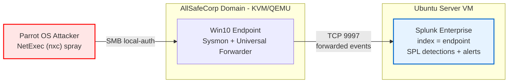

# Defensive Logging & Monitoring (Splunk SIEM & Detection Engineering Lab)

## Context & Motivation

This repository layers a **SIEM and detection-engineering capability** on top of
an existing enterprise Active Directory environment —
[Enterprise-Zero-Trust-AD](https://github.com/nicolas-raducan/Enterprise-Zero-Trust-AD).
Where that lab *hardens* a Windows domain, this project *watches* it: it
collects endpoint telemetry, centralises it in Splunk, and authors custom
detections mapped to the **MITRE ATT&CK** framework.

The motivation is to close the single biggest hands-on gap for a SOC Analyst
role: **operating a SIEM against real endpoint data** — onboarding logs,
writing SPL, and turning raw telemetry into threshold-based alerts that fire on
attacker behaviour rather than on signatures.

## Table of Contents
1. [Project Overview](#project-overview)
2. [Architecture](#architecture)
3. [Technologies & Core Concepts](#technologies--core-concepts)
4. [Detection Model](#detection-model)
5. [Repository Structure](#repository-structure)
6. [System Requirements](#system-requirements)
7. [Installation & Setup Guide](#installation--setup-guide)
8. [Key Implementation Features](#key-implementation-features)
9. [Validation & Test Scenarios](#validation--test-scenarios)
10. [Engineering Lessons](#engineering-lessons)

## Project Overview

A SIEM pipeline built around **Splunk Enterprise (Free tier)** running headless
on an Ubuntu Server VM as the indexer and search head. A Windows 10 endpoint
(one of the AllSafeCorp domain's managed VMs) runs **Sysmon** for high-fidelity
process/network telemetry and a **Splunk Universal Forwarder** that ships both
Sysmon and Windows Security events to the indexer. Custom **SPL** detections then
identify credential-attack activity and are mapped to **MITRE ATT&CK** techniques.

## Architecture

Telemetry flows one way from the monitored endpoint to the indexer; an attacker
VM generates the activity the detections are designed to catch.




## Technologies & Core Concepts

* **SIEM & Data Onboarding:** Splunk Enterprise (Free tier) — indexer, search head, dedicated `endpoint` index, TCP receiving input on 9997.
* **Endpoint Telemetry:** Sysmon (SwiftOnSecurity community config), Splunk Universal Forwarder, Windows Security event log.
* **Detection Engineering:** SPL (`stats`, `where`, `bin`, `eval`), threshold-based scheduled alerts.
* **Threat Mapping:** MITRE ATT&CK (Credential Access, Lateral Movement).
* **Virtualization:** KVM/QEMU, `libvirt`, `virt-manager` (shared with the AD lab environment).

## Detection Model

Each detection turns a raw telemetry source into a behavioural alert and maps it
to the technique it catches.

| Detection | Telemetry source | Detection logic | MITRE ATT&CK | Status |
|---|---|---|---|---|
| **Brute-force / password spray** | Windows Security (4625) | ≥10 failed network logons (`Logon_Type=3`) from one source within a 5-min window; `users_targeted` (distinct accounts hit) flags spraying | T1110 · .003 detected · .001 contained by lockout | **Detected** |
| **Spray-then-succeed** | Windows Security (4625 + 4624) | A 4625 burst followed by a 4624 success from the same source — the attempt landed | T1110 + T1078 | Future work |
| **LSASS credential access** | Sysmon (Event ID 10) | Process access handle opened against `lsass.exe` | T1003.001 | Stretch |
| **PsExec lateral movement** | Sysmon (Event ID 1 + 3) | Service-style process creation paired with SMB (445) network connection | T1021.002 | Stretch |

## Repository Structure

* `docs/`: Per-phase build notes and the full command/troubleshooting reference.
    * `01-splunk-setup.md`: Phase 1 — Splunk indexer install, hardening, gotchas.
    * `02-endpoint-pipeline.md`: Phase 2 — Sysmon + forwarder onboarding.
* `configs/`: Sanitized `inputs.conf` / `outputs.conf` from the forwarder.
* `detections/`: Saved SPL queries / alert definitions.
* `screenshots/`: Visual proof of the pipeline and triggered alerts.

> Configs and docs contain no real secrets — no credentials, tokens, or real
> public/corporate IPs. The lab's RFC1918 addressing and fictional identity are
> shown as-is, consistent with the linked AD lab repo.

## System Requirements

**Hosts (all virtualized on the existing KVM/QEMU lab host):**
* **Splunk indexer:** Ubuntu Server 24.04 — 4 GB RAM, 2 vCPU, 25 GB disk.
* **Monitored endpoint:** Windows 10 — a managed Tier 2 VM from the AD lab.
* **Attacker:** Parrot OS — used in Phase 3 to generate brute-force telemetry.

**Software:**
* Splunk Enterprise Free (≤ 500 MB/day) and the matching Universal Forwarder.
* Sysmon + the SwiftOnSecurity `sysmonconfig-export.xml`.

## Installation & Setup Guide

### Phase 1 — Splunk Indexer

On the Ubuntu Server VM (full commands and troubleshooting in
[`docs/01-splunk-setup.md`](docs/01-splunk-setup.md)):

```bash
# install the .deb to /opt/splunk, hand it to a non-root runtime user, add to PATH
sudo chown -R splunk-svc:splunk-svc /opt/splunk
echo 'export PATH=$PATH:/opt/splunk/bin' >> ~/.bashrc && source ~/.bashrc

# run as splunk-svc, no sudo: start, enable the receiving port, create the index
splunk start --accept-license
splunk enable listen 9997 -auth admin:<pw>
splunk add index endpoint

# these two need root: boot persistence (writes a systemd unit) and the firewall
sudo /opt/splunk/bin/splunk enable boot-start -user splunk-svc
sudo ufw allow 9997/tcp
```

### Phase 2 — Endpoint Telemetry Pipeline

On the Windows 10 endpoint:

```powershell
# 1. install Sysmon with the community config (elevated prompt)
.\sysmon64.exe -accepteula -i sysmonconfig-export.xml

# 2. install the Universal Forwarder, point it at the indexer
.\splunk.exe add forward-server 10.0.0.100:9997
```

Then collect both logs via `inputs.conf` and ship them via `outputs.conf`
(see [`configs/`](configs/)):

```ini
[WinEventLog://Security]
start_from = oldest
current_only = false
index = endpoint

[WinEventLog://Microsoft-Windows-Sysmon/Operational]
start_from = oldest
current_only = false
renderXml = true
index = endpoint
```

**Acceptance check** — in Splunk, both sourcetypes appear:

```spl
index=endpoint | stats count by sourcetype
```

### Phase 3 — Brute-Force Detection

From Parrot OS, **NetExec (`nxc`)** sprays throwaway **local** accounts over SMB
(`--local-auth`, so the `4625`s log on the Win10 endpoint where the forwarder ships
them — a domain logon would log on the DC, which has no forwarder). The scheduled
SPL alert from the [Detection Model](#detection-model) then fires on the volume.
Full write-up: [`docs/03-brute-force-detection.md`](docs/03-brute-force-detection.md).

### Phase 4 — ATT&CK Mapping & Write-up

The firing detection is mapped to MITRE ATT&CK (T1110 / .001 / .003), with the
validation evidence and limitations in
[`docs/03-brute-force-detection.md`](docs/03-brute-force-detection.md).

## Key Implementation Features

### 1. Isolated telemetry index
Windows endpoint data lands in a dedicated `endpoint` index, kept separate from
Splunk's internal logs — cleaner searches and a clear data-retention boundary.

### 2. Community-standard Sysmon baseline
Rather than hand-writing a Sysmon config, the project deploys the
**SwiftOnSecurity** baseline — the recognised community standard — demonstrating
the judgement to adopt and version a vetted config over reinventing one.

### 3. Behavioural, threshold-based detection
The brute-force detection alerts on a *rate of failures* and the
*spray-then-succeed* pattern (failures followed by a success), not on any single
event — detection logic grounded in attacker behaviour.

### 4. Secure-by-default operation
Splunk runs as a dedicated non-root user (root execution is deprecated in 10.x),
and email-alert delivery is restricted to an allow-listed domain to prevent
search results being exfiltrated to arbitrary recipients.

## Validation & Test Scenarios

*Phase 1:* Splunk web UI loads with no startup errors and the receiving port is
listening (`splunk display listen`); the `endpoint` index exists.

*Phase 2:* both sourcetypes arrive in `index=endpoint`
([`screenshots/01_both-sourcetypes.png`](screenshots/01_both-sourcetypes.png)) —
`WinEventLog:Security` and the Sysmon channel.

*Phase 3:* the spray is generated
([`02_nxc-attack.png`](screenshots/02_nxc-attack.png)), the failures arrive via the
forwarder ([`03_host-endpoint.png`](screenshots/03_host-endpoint.png)), the detection
row fires — count 31, `users_targeted` 7
([`04_detection-row.png`](screenshots/04_detection-row.png)) — and the alert appears
under *Activity → Triggered Alerts*
([`05_fired-alert.png`](screenshots/05_fired-alert.png)).

## Engineering Lessons

* **A failed graphical *installer* ≠ an unusable desktop.** The Ubuntu 24.04
  Desktop *live ISO* black-screened under virt-manager, so the indexer was built
  from the Server ISO's text installer. Installing `xubuntu-desktop` on top of
  the running Server base afterwards worked cleanly — proving the failure was
  specific to the live ISO's installer environment, not the desktop packages.
* **Subiquity's guided LVM under-allocates root.** The installer left part of the
  25 GB disk as unused free space in the volume group, surfacing as
  `No space left on device` during install; fixed by extending the root LV
  (`lvextend -r -l +100%FREE`).
* **Splunk 10.x ownership model.** The `.deb` installs as root, but running
  Splunk as root is deprecated — ownership had to be handed to a dedicated
  service user, and `/opt/splunk/bin` added to `PATH` (`SPLUNK_HOME` does not do
  this).
* **Account lockout reshaped the detection — key on source IP, not username.**
  Single-account brute force self-defeats: the lockout policy caps any account at
  ~6 failures (below the 10 threshold), so grouping by username never fires.
  Re-keying the rule on `Source_Network_Address` and aggregating across accounts —
  with `dc(Account_Name)` as the spray tell — is what actually catches the attack.
  The defensive control directly shaped the detection logic (T1110.001 guessing vs
  .003 spraying).
* **Time integrity is foundational for a SIEM — "consistent but wrong" is the
  trap.** Events were present over *All time* yet invisible to recent search
  windows, so the scheduled alert never fired despite live attacks. Cause:
  clock/timezone skew across hosts — the DC and endpoint *agreed with each other*
  on a wrong time, so internal consistency masked the error. Verify clocks against
  an external truth, never internal agreement; skew silently breaks every
  time-window rule and cross-host correlation.
* **Know the attack you detect — local vs domain auth decides where the `4625`
  lands.** Hydra's SMB module couldn't negotiate SMBv2/3 (switched to NetExec), and
  `nxc` defaulted to *domain* auth — landing the `4625` on the DC (no forwarder →
  invisible). `--local-auth` forces authentication against the endpoint's local
  SAM, so the event is logged where the forwarder ships it. Understanding the
  tooling was a prerequisite to collecting the telemetry.
