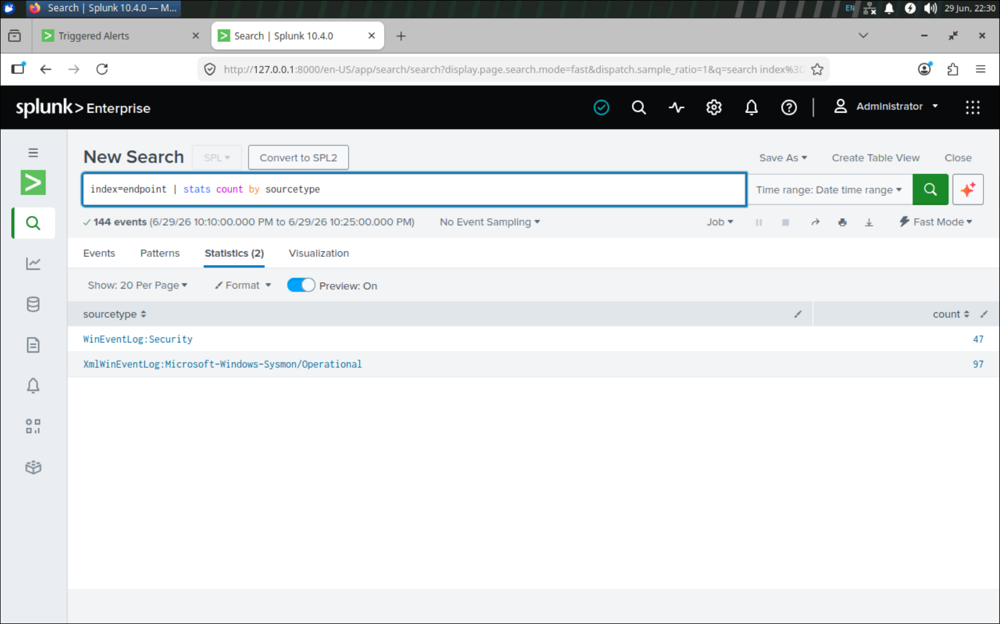

# Phase 2 — Endpoint Telemetry Pipeline

Goal: get both **Windows Security** and **Sysmon** events flowing from the
Windows 10 endpoint into the Splunk indexer's `endpoint` index.

```
Win10 endpoint                              Ubuntu indexer
┌───────────────────────────┐              ┌────────────────────┐
│ Sysmon (SwiftOnSecurity)  │              │ Splunk Enterprise  │
│ Windows Security log       │── TCP 9997 ─▶│ index = endpoint   │
│ Universal Forwarder        │   forward    │                    │
└───────────────────────────┘              └────────────────────┘
```

## Step 1 — Install Sysmon (SwiftOnSecurity config)

From an **elevated** prompt in the folder with `sysmon64.exe` and the config:

```powershell
.\sysmon64.exe -accepteula -i sysmonconfig-export.xml
```

- Config source / version: [SwiftOnSecurity `sysmon-config`](https://github.com/SwiftOnSecurity/sysmon-config) (`sysmonconfig-export.xml`). The config targets schema **4.50**; the installed Sysmon runs **4.91** — left as-is, since Sysmon is backward-compatible with older configs and this baseline needs no newer-schema features.
- Verify events at: `Event Viewer → Applications and Services Logs → Microsoft →
  Windows → Sysmon → Operational`.

**Check:** Sysmon Operational log is populating with Event ID 1 (process create).

> Notes / surprises: Sysmon is a **sensor, not a detector** — it presents every
> event at "Informational", so the *filtering* is the config's job (`Image`,
> `CommandLine`, `ProcessGUID`, hashes, parent process). Verified the install with
> `Get-WinEvent` — listed the log and grouped events by ID / count / level — not
> just Event Viewer.

## Step 2 — Install the Splunk Universal Forwarder

- Installer: Splunk Universal Forwarder MSI (`splunkforwarder.msi`), installed from the CLI via `msiexec`.
- Install path: `C:\Program Files\SplunkUniversalForwarder`

```powershell
cd "C:\Program Files\SplunkUniversalForwarder\bin"
.\splunk.exe add forward-server 10.0.0.100:9997
.\splunk.exe enable boot-start
```

> Notes / surprises: `msiexec` first failed with "installation package could not
> be opened" on the `.\` **relative path** — checked the file size and **hash** to
> rule out a corrupt download (intact), then fixed it with the **absolute** MSI
> path. Chose **`Local System`** as the forwarder service account — the only option
> that can read the **Security** event log by default (a conscious trade of strict
> least-privilege for working local collection). `inputs.conf` / `outputs.conf`
> were **hand-written** rather than built with the wizard, which can't add the
> custom Sysmon channel.

## Step 3 — Configure inputs

`...\SplunkUniversalForwarder\etc\system\local\inputs.conf` — commit a sanitized
copy to [`../configs/inputs.conf`](../configs/inputs.conf).

```ini
[WinEventLog://Security]
start_from = oldest
current_only = false
index = endpoint
# auth events: 4625 (failed), 4624 (success), 4648 (explicit creds)

[WinEventLog://Microsoft-Windows-Sysmon/Operational]
start_from = oldest
current_only = false
renderXml = true
index = endpoint
```

## Step 4 — Configure output

`...\SplunkUniversalForwarder\etc\system\local\outputs.conf` — sanitized copy to
[`../configs/outputs.conf`](../configs/outputs.conf).

```ini
[tcpout]
defaultGroup = sp

[tcpout:sp]
server = 10.0.0.100:9997
```

Restart the forwarder after editing either file:

```powershell
.\splunk.exe restart
```

## Step 5 — Verify the pipeline

In Splunk Web search — **both** sourcetypes must appear:

```spl
index=endpoint | stats count by sourcetype
```

Expected: `WinEventLog:Security` **and**
`XmlWinEventLog:Microsoft-Windows-Sysmon/Operational`.



## Troubleshooting

| Symptom | Cause | Fix |
|---|---|---|
| Forwarder install fails ("package could not be opened") | `msiexec` choked on the `.\` relative path | Invoke with the **absolute** MSI path |
| Forwarder running, no data in `endpoint` | Indexer was on a DHCP address that could change and silently break `outputs.conf` | Pin a **static IP outside the DHCP pool** on the indexer |
| Events present over *All time* but missing from recent windows | Clock / timezone skew across hosts (indexer, DC, endpoint) | Align TZ + UTC on every host so 4625 timestamps land in the search window |

Quick checks:

```spl
index=_internal source=*metrics.log* group=tcpin_connections
```
```powershell
Test-NetConnection 10.0.0.100 -Port 9997
```

## Result

Both sourcetypes confirmed arriving in `index=endpoint` — `WinEventLog:Security` and `XmlWinEventLog:Microsoft-Windows-Sysmon/Operational` (Step 5). The endpoint telemetry pipeline is live; Phase 3 builds the brute-force detection on top of this Security-log feed.

→ **Next:** [Phase 3 — Brute-Force Detection](03-brute-force-detection.md)
