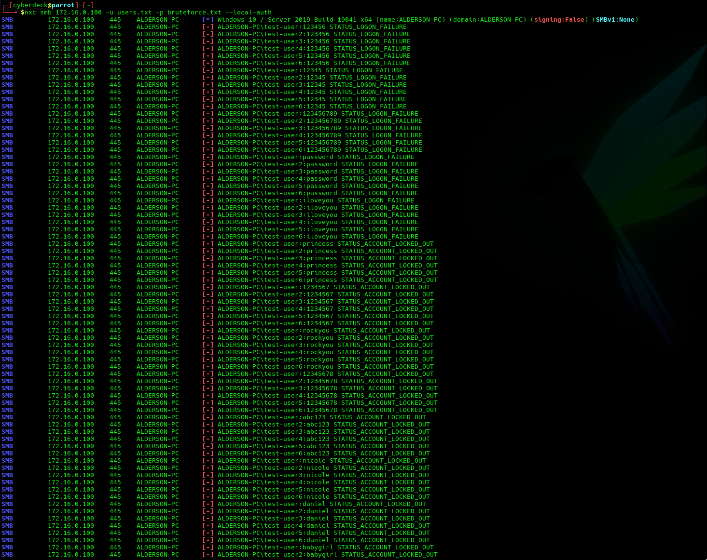
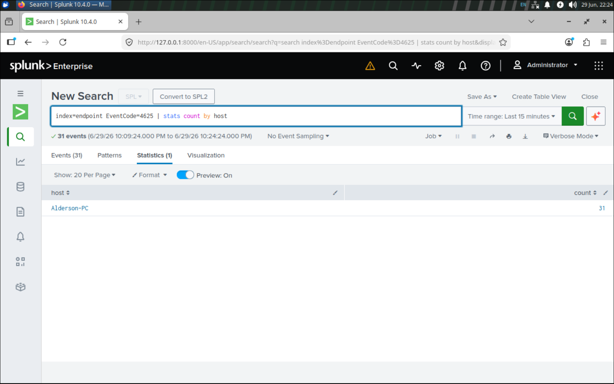
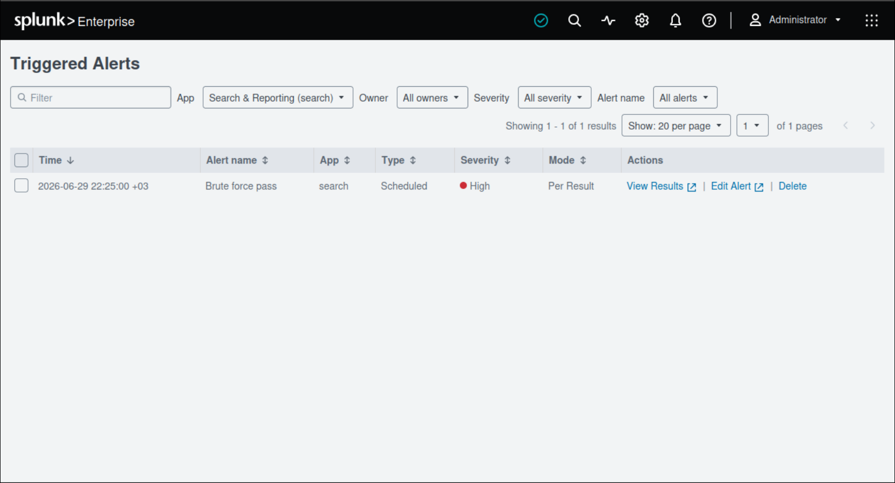

# Phase 3 — Brute-Force Detection

## Summary

### Search
```spl
index=endpoint EventCode=4625 Logon_Type=3 | bin _time span=5m | stats count dc(Account_Name) as users_targeted by _time, Source_Network_Address | where count >= 10
```
Scopes to failed network logons (4625, Logon_Type=3 — the SMB/remote path), buckets into 5-minute windows, and tallies per source address: count = total failures, users_targeted = distinct accounts hit. Fires when a source reaches ≥10 failures — which, given the ~6-attempt lockout, means the source has necessarily touched multiple accounts. users_targeted is the triage discriminator (1 = guessing pivot, many = spraying)

### Alert configuration

- Type — scheduled, not real-time. Run on a 5-minute cron. Scheduled was chosen deliberately over real-time to spare the single lab indexer the continuous query load.

- Trigger — "Number of Results > 0." The real detection threshold (≥10) lives inside the search, so any row that survives has already crossed the bar; the alert simply fires if any account did.

- Throttle — suppress by Source_Network_Address for 15 minutes. This maps each attacker to a single alert instead of one per overlapping run.

### The four time parameters 

 | Parameter             | Value  |Job                                                              |
 |-----------------------|--------|-----------------------------------------------------------------|
 | Schedule              | 5 min  | How often the search runs                                       |
 | Search time range     | 15 min | How far back each run looks                                     |
 | Counting window (bin) | 5 min  | The span over which failures are tallied toward the threshold   |
 | Throttle              | 15 min | How long repeat alerts from the same source are suppressed      |

The search range (15 min) is deliberately wider than the 5-minute schedule to tolerate Universal Forwarder lag and events that straddle a bucket boundary. Because that wider range makes consecutive runs overlap, the throttle is set to the same 15 minutes so the same burst of failures is not re-alerted on every run.

## Detection Hypothesis

A brute-force attack cannot be carried out quietly — it produces a burst of failed authentications in a short time. In this domain an account-lockout policy caps any single account at roughly six failed attempts before it locks, so a high volume of failures from one source necessarily means the attacker is spreading across multiple accounts. The detection turns that into a measurable rate: it filters to network failed-logons (Event ID 4625, Logon_Type=3), groups them per source address over a 5-minute window, counts the failures and the distinct accounts targeted, and fires when one source crosses ten. Single-account guessing is contained upstream by the lockout control itself; this alert catches the broader, multi-account credential attack the lockout forces an attacker into.

## Data Source

**Telemetry:** Windows Security Event Log - failed-logon events **(Event ID 4625)**

Every field the detection relies on comes from the 4625 record:

|Field                  |Role in the detection                                                                                      |
|-----------------------|-----------------------------------------------------------------------------------------------------------|
|EventCode=4625         | The failed-logon event itself - the raw signal                                                            |
|Logon_Type=3           | Scopes to network logons (the SMB/remote path the attack used, filtering out interactive/console noise)   |
|Source_Network_Address | Aggregation key - identifies the attacker's source IP                                                         |
|Account_Name           | The targeted account - surfaced as users_targeted for triage (1 = guessing, many = spraying)                  |

**Collection path**. The events reach Splunk over the Phase 2 pipeline: the Windows Security log is collected on the endpoint by the Universal Forwarder via a [WinEventLog://Security] input and forwarded to the indexer's endpoint index, where it lands under sourcetype WinEventLog:Security.

```ini
[WinEventLog://Security]
start_from = oldest
current_only = false
index = endpoint
```

**Prerequisite — the detection is blind without it.** A 4625 is only written if failure auditing for logon events is enabled on the endpoint (Audit Policy → Logon/Logoff → Audit Logon → Failure, or the legacy Audit logon events). If that audit setting is off, failed logons generate no event, the search returns zero rows, and the alert silently reads as "all clear" — a false sense of safety, not an actual absence of attacks. This audit policy is therefore a hard dependency of the detection, not an optional hardening step.

## Detection Logic

The SPL query is comprised of 4 stages. These are the search filter, time bucket, grouping and a post-aggregation filter that triggers the alert. Each of the stages are divided using pipes `|`.

### The search filter:

```spl
index=endpoint EventCode=4625 Logon_Type=3
```

For the search filter there are 3 main properties that are filtered by. First we have `index=endpoint` which points to the storage bucket the data lives, `EventCode=4625` filters the logs that have the **Event ID** of 4625 - **Failed Logon** and `Logon_Type=3` looks for `SMB/Network` connections.

### The time bucket:

```spl
bin _time span=5m
```

This command rounds each event's timestamp down to its 5 minute bucket, which makes the later grouping by _time possible.

### The grouping:

```spl
stats count dc(Account_Name) as users_targeted by _time, Source_Network_Address
```
The `count` tallies total failures; `dc(Account_Name)` counts distinct accounts hit, aliased `users_targeted`; `by _time, Source_Network_Address` then groups per source per 5-minute bucket. 

### The post-aggregation filter:

```spl
where count >= 10
```
Final filtering of the events is made using the threshold of at least 10 failed logon events. 

This approach allows for a vertical-horizontal insight of the spl query. Grouping by Source_Network_Address gives a per-source view; users_targeted then reveals whether that source went vertical (one account) or horizontal (many) - the spray signal.


```spl
index=endpoint EventCode=4625 Logon_Type=3 | bin _time span=5m | stats count dc(Account_Name) as users_targeted by _time, Source_Network_Address | where count >= 10
```

## Threshold rationale

The domain of the **win10-client** has an account-lockout policy that caps a single account at **~6** failures before it locks. The threshold was set relative to that in order to avoid the scenario when a regular user would mistype their password and the alert would be triggered with no attacker involved. By setting it at **10**, this guarantees that the first scenario doesn't happen and also helps showcase that one source targets at least **2 accounts**. By doing so this is the smallest count that can't be a **single locked-out account**.

If the threshold would be **lowered**, this would definitely help find instances when a low number of attempts were made - if the **threshold was 3** this could help find these types of attacks, but at the same time, this would produce **false positives** from a genuine user who mistypes their password; and dropping the threshold below **6 surrenders the at least 2 accounts guarantee**. In contrast, by doing the opposite - raising the threshold, the number of **false negatives** would be raised, and it presents a risk of losing the **low-and-slow, small-volume attackers**.

In concordance with the **10** failed total attempts, a time window of **5 minutes** is set, thus creating a **rate (~2/min) on which the threshold** is based. The reason why the rate is the way to think about a brute-force attack rather than a raw count is because all brute-force attacks share this characteristic of **fast, repeated attempts**.A raw count wouldn't be able to tell the *difference* between *10 failures spread across multiple days or weeks and 10 failures in two minutes*.

If it were to stretch this window to **60 minutes** and keep the same **count of 10**, now in the course of an hour the rate of *false positives* would increase. Because one user, or many users can login multiple times in that time frame, and sometimes they might input the *wrong credentials*. As a consequence of stretching the window, it would result in a large number of attempts accumulating into a single bucket. By stretching the window we also lose the quality of burst signal, which is genuinely helpful, because as stated before brute-force techniques are usually fast. **In contrast**, shrinking it to **30 seconds** would increase the number of *false negatives* due to the **Universal Forwarder lag**, while also **missing the attackers** who take a **slower approach** on their attempts.


## ATT&CK Mapping

| Tactic & ID                | Data Source                | Technique           | Sub-Technique                 | State                                                                                                      |
| -------------------------- | -------------------------- | ------------------- | ----------------------------- | ---------------------------------------------------------------------------------------------------------- |
| Credential Access - TA0006 | Authentication Logs / 4625 | Brute Force - T1110 | parent - source-volume rule   | Detected — ≥10 failures from one source per 5-min window                                                   |
| Credential Access - TA0006 | Authentication Logs / 4625 | Brute Force - T1110 | Password Guessing - T1110.001 | Contained by control - account-lockout caps a single account at ~6, below threshold; prevented not alerted |
| Credential Access - TA0006 | Authentication Logs / 4625 | Brute Force - T1110 | Password Spraying - T1110.003 | Detected - multi-account volume from one source trips the rule.                                            |

## False Positives

A reason for false positives could be stale cached creds or a service account with a rotated password. In the case of a single user, they will be locked-out at ~6 attempts and would not reach the threshold, resulting in the alert not being triggered. The service account would be a special case, since it's typically exempt from lockout and could genuinely rack up 10+ failures on a single account. However it would be self-cleared due to the alert taking account of `users_targeted`.

Due to the possibility of having a catalogued VPN concentrator, RDS host or branch gateway, the detection might fire resulting in a false positive. That is where an analyst's knowledge of assets and inventory is required. By having the context of the source IP, they can properly decide to clear or flag the alert forward. Another important contextual part from the analyst that cannot be decided from the detection is the timing of the alert. By taking into account the time-of-day and the spacing between attempts, an analyst is able to differentiate between genuine user failures that happen in business hours, or 10 failures at 3 AM from a host nobody should be using. The spacing is important because of rhythm, if it happens at a regular pace of ~30s, then it's an automated service account retrying on a timer, but a brute-force tool would have many attempts per second. 

## Validation

For the attacker simulation Hydra was replaced by NXC, due to Hydra's SMB module being SMBv1 era and couldn't negotiate the Win10 client's SMBv2/v3. The command and attack attempt:



This command uses the smb protocol, two text-files: a username list and a password list. The `--local-auth` flag is used in order for the `4625` events to be logged on Win10 instead of the DC, which has no forwarder.

After running the brute-force attack, the logs arrived through the pipeline:




The image shows the attacker's `Source_Network_Address`, the `count` of 31, and `users_targeted` being 7. 7 accounts at count 31 confirms spraying because lockout caps a single account ~6 - so spreading across accounts is the only way to reach 31. All these facts come together to confirm the password spray hypothesis, instead of being a false positive of "someone has failed a lot".

The alert was successfully fired:



## Limitations

The first limitation of the set alert is the single-account guessing. It is being contained by lockout, but the detection is blind to it with lockout caps a single account at ~6, which is below the threshold of 10. Even if it is being prevented by the lockout, a patient single-account guesser leaves no SIEM trace in this design. The way to close this gap would be by either lowering the per-account rule, or alerting on the lockout `event 4740` itself.

There is no domain-side visibility, the pipeline watches one endpoint. Only the Win10 client forwards, domain-account auth resolves at the DC, whose 4625s are not being collected. There is however one major blind spot with this, and that is someone spraying domain accounts which is invisible to the SIEM instance. The fix is part of the stretch goals mentioned in the `README`; of forwarding the DC's Security logs into the same endpoint index.

Future work is comprised of two main actions. First is creating a second alert that correlates a 4625 burst followed by a 4624 success from the same source. That detects the worst-case scenario, where a breach happened. Second is making the alert actionable. At this moment the alert is only being logged in Triggered Alerts. Following this a real action would be needed, sending an email or a Slack/Teams webhook.